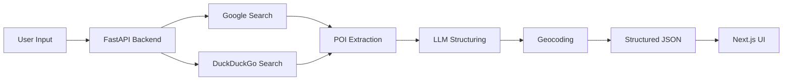

# POICurator

An AI-assisted POI curation system that aggregates noisy web search results and extracts structured POI information including names, addresses, phone numbers, URLs, and geocodes.

Real-world POI information across the web is often fragmented, noisy, multilingual, and inconsistent.
POI Curator was built to explore how search aggregation, heuristic extraction, geocoding, and LLM reasoning can be combined into a lightweight POI retrieval pipeline.

## Features

- Multi-source POI retrieval
- Google + DuckDuckGo aggregation
- Address extraction
- Phone number extraction
- URL extraction
- Geocoding integration
- LLM-assisted ambiguity resolution
- FastAPI backend
- Next.js frontend
- Interactive map rendering

  ## System Architecture


## Engineering Challenges

### Global Address Ambiguity
Search snippets often contain:
- partial addresses
- multilingual text
- PO boxes
- unrelated metadata
- mixed formatting

### Geocoding Reliability
Different geocoding providers occasionally produced inconsistent or inaccurate coordinates for noisy address inputs.

### Rule-based Extraction Limitations
Regex and heuristic-based extraction worked for structured formats but became brittle for globally inconsistent address patterns.

### Why LLM Reasoning Was Introduced
To improve robustness for ambiguous and noisy POI data, an LLM reasoning layer was added to infer the most probable structured output.

## Current Limitations

- Some geocodes may be inaccurate for highly ambiguous addresses
- Search snippets can contain incomplete or noisy metadata
- Global address formats remain difficult to normalize consistently
- Results depend partially on search engine quality

  ## Future Improvements

- Spatial confidence scoring
- Multi-geocoder consensus
- Probabilistic geocode refinement
- Better multilingual address normalization
- POI verification workflows

  ## Tech Stack

Backend:
- Python
- FastAPI

Frontend:
- Next.js
- TailwindCSS

Search & Retrieval:
- Google Serper API
- DuckDuckGo Search

AI:
- Grok API

Geospatial:
- Google Maps Geocoding API

## Quick Start

```bash
git clone https://github.com/VAMSEE92/POICurator.git
cd POICurator

pip install -r requirements.txt

uvicorn main:app --reload
```

## Contributing

Suggestions, improvements, and contributions are welcome.

Feel free to open issues, discussions, or pull requests.

---

## Acknowledgements

This project explores the intersection of:
- search systems
- geospatial intelligence
- LLM reasoning
- POI curation workflows

---

## License

MIT License

    I --> J[Map Visualization]
```
